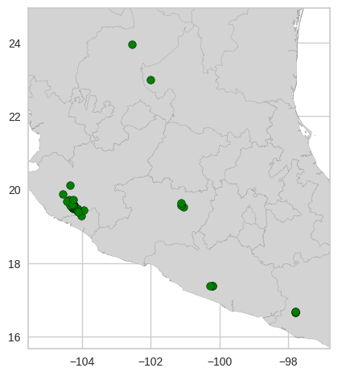

# Simple Species Distribution Model in Python
## Introduction
Species distribution model are...

### Species Distribution Models 
Species Distribution Models (SDM)
We are going to produce an species distribution model using python and GBIF data.

### Species of interest
We selected a Magnolia species called Magnolia iltisiana. This is a Tree that inhabits in the western part of Mexico. 


## Methods
### Data download
For this guide we will use data downloaded from the Global Biodiversity Information Facility ([GBIF](https://www.gbif.org/)). the GBIF database contains a huge collection of information about all kinds of organisms. Our main interest in this database is the information about the distribution of the species.
For this guide we will search and download the information about our species Magnolia iltisiana.


We have to select the correct species from the suggested results.


Here we can see all the data available for this species in the GBIF database. In our case our main interest are the ocurrences link above the images.


In the occurrences site we found a table with all kind of information about the species. In particular we can find the localities were the species has been found. This data is gatered from different sources. We can review this in the Basis of record and Dataset columns.


Once we reviewed the data of our species we can download the database using the link at the top of the website. This will generate an unique download link with their corresponding reference. It is recommended to save this information for future reference.

As variables for our model we will use the 19 bioclimatic variables of [world clim](https://www.worldclim.org/data/worldclim21.html). We also going to include the elevation layer also from world clim. All layer were downloaded with a resolution of 30s and saved in a folder called *variables*.


### Data preprocesing
We will mainly use the pandas and geopandas library for the data management and matplotlib.pyplot for the figures. For the clustering and predictive models we will use the modules of scikit learn. Aditionally we will use a couple of custom functions from the file sdm_functions.py


```python
import geopandas as gpd
import matplotlib.pyplot as plt
import numpy as np
import pandas as pd
import random
import rasterio
from rasterio.plot import show
# from shapely.geometry import Polygon
# from sklearn import decomposition
from sklearn.cluster import AgglomerativeClustering, KMeans
from sklearn.ensemble import RandomForestRegressor
from sklearn.metrics import mean_squared_error
import sys
from yellowbrick.cluster import KElbowVisualizer

from sdm_functions import sdm_functions as fun

```

We start by reading the data downloaded from GBIF:


```python
sp = pd.read_csv('magnolia_iltisiana.csv', sep='\t')
sp
```


<div>
<style scoped>
    .dataframe tbody tr th:only-of-type {
        vertical-align: middle;
    }

    .dataframe tbody tr th {
        vertical-align: top;
    }

    .dataframe thead th {
        text-align: right;
    }
</style>
<table border="1" class="dataframe">
  <thead>
    <tr style="text-align: right;">
      <th></th>
      <th>gbifID</th>
      <th>datasetKey</th>
      <th>occurrenceID</th>
      <th>kingdom</th>
      <th>phylum</th>
      <th>class</th>
      <th>order</th>
      <th>family</th>
      <th>genus</th>
      <th>species</th>
      <th>...</th>
      <th>identifiedBy</th>
      <th>dateIdentified</th>
      <th>license</th>
      <th>rightsHolder</th>
      <th>recordedBy</th>
      <th>typeStatus</th>
      <th>establishmentMeans</th>
      <th>lastInterpreted</th>
      <th>mediaType</th>
      <th>issue</th>
    </tr>
  </thead>
  <tbody>
    <tr>
      <th>0</th>
      <td>4032005328</td>
      <td>7bd65a7a-f762-11e1-a439-00145eb45e9a</td>
      <td>urn:catalog:MO:Tropicos:103115759</td>
      <td>Plantae</td>
      <td>Tracheophyta</td>
      <td>Magnoliopsida</td>
      <td>Magnoliales</td>
      <td>Magnoliaceae</td>
      <td>Magnolia</td>
      <td>Magnolia iltisiana</td>
      <td>...</td>
      <td>José Antonio Vázquez García</td>
      <td>2016-01-01T00:00:00</td>
      <td>CC_BY_4_0</td>
      <td>Missouri Botanical Garden</td>
      <td>Guillermo Ibarra Manríquez</td>
      <td>NaN</td>
      <td>NaN</td>
      <td>2023-02-17T22:10:50.597Z</td>
      <td>NaN</td>
      <td>COORDINATE_ROUNDED;GEODETIC_DATUM_ASSUMED_WGS8...</td>
    </tr>
    <tr>
      <th>1</th>
      <td>4031977117</td>
      <td>7bd65a7a-f762-11e1-a439-00145eb45e9a</td>
      <td>urn:catalog:MO:Tropicos:101810366</td>
      <td>Plantae</td>
      <td>Tracheophyta</td>
      <td>Magnoliopsida</td>
      <td>Magnoliales</td>
      <td>Magnoliaceae</td>
      <td>Magnolia</td>
      <td>Magnolia iltisiana</td>
      <td>...</td>
      <td>A. Vazquez</td>
      <td>1989-01-01T00:00:00</td>
      <td>CC_BY_4_0</td>
      <td>Missouri Botanical Garden</td>
      <td>Theodore S. Cochrane;Mark A. Wetter;Francisco ...</td>
      <td>NaN</td>
      <td>NaN</td>
      <td>2023-02-17T22:09:10.816Z</td>
      <td>StillImage</td>
      <td>GEODETIC_DATUM_ASSUMED_WGS84;TYPE_STATUS_INVAL...</td>
    </tr>
    <tr>
      <th>2</th>
      <td>4031769395</td>
      <td>7bd65a7a-f762-11e1-a439-00145eb45e9a</td>
      <td>urn:catalog:MO:Tropicos:102798081</td>
      <td>Plantae</td>
      <td>Tracheophyta</td>
      <td>Magnoliopsida</td>
      <td>Magnoliales</td>
      <td>Magnoliaceae</td>
      <td>Magnolia</td>
      <td>Magnolia iltisiana</td>
      <td>...</td>
      <td>J.A. Vazquez-García</td>
      <td>2011-01-01T00:00:00</td>
      <td>CC_BY_4_0</td>
      <td>Missouri Botanical Garden</td>
      <td>Esteban M. Martínez S.;Fred R. Barrie</td>
      <td>NaN</td>
      <td>NaN</td>
      <td>2023-02-17T22:09:20.822Z</td>
      <td>NaN</td>
      <td>COORDINATE_ROUNDED;GEODETIC_DATUM_ASSUMED_WGS8...</td>
    </tr>
    <tr>
      <th>3</th>
      <td>4031769394</td>
      <td>7bd65a7a-f762-11e1-a439-00145eb45e9a</td>
      <td>urn:catalog:MO:Tropicos:102798078</td>
      <td>Plantae</td>
      <td>Tracheophyta</td>
      <td>Magnoliopsida</td>
      <td>Magnoliales</td>
      <td>Magnoliaceae</td>
      <td>Magnolia</td>
      <td>Magnolia iltisiana</td>
      <td>...</td>
      <td>J.A. Vazquez-García</td>
      <td>2011-01-01T00:00:00</td>
      <td>CC_BY_4_0</td>
      <td>Missouri Botanical Garden</td>
      <td>Esteban M. Martínez S.;T.P. Ramamoorthy</td>
      <td>NaN</td>
      <td>NaN</td>
      <td>2023-02-17T22:10:42.613Z</td>
      <td>NaN</td>
      <td>COORDINATE_ROUNDED;GEODETIC_DATUM_ASSUMED_WGS8...</td>
    </tr>
    <tr>
      <th>4</th>
      <td>4031691547</td>
      <td>7bd65a7a-f762-11e1-a439-00145eb45e9a</td>
      <td>urn:catalog:MO:Tropicos:102650175</td>
      <td>Plantae</td>
      <td>Tracheophyta</td>
      <td>Magnoliopsida</td>
      <td>Magnoliales</td>
      <td>Magnoliaceae</td>
      <td>Magnolia</td>
      <td>Magnolia iltisiana</td>
      <td>...</td>
      <td>K. Velasco</td>
      <td>2008-01-01T00:00:00</td>
      <td>CC_BY_4_0</td>
      <td>Missouri Botanical Garden</td>
      <td>Arturo Nava Zafra;K. Velasco G.;Nahúm García G.</td>
      <td>NaN</td>
      <td>NaN</td>
      <td>2023-02-17T22:09:26.660Z</td>
      <td>NaN</td>
      <td>COORDINATE_ROUNDED;GEODETIC_DATUM_ASSUMED_WGS8...</td>
    </tr>
    <tr>
      <th>...</th>
      <td>...</td>
      <td>...</td>
      <td>...</td>
      <td>...</td>
      <td>...</td>
      <td>...</td>
      <td>...</td>
      <td>...</td>
      <td>...</td>
      <td>...</td>
      <td>...</td>
      <td>...</td>
      <td>...</td>
      <td>...</td>
      <td>...</td>
      <td>...</td>
      <td>...</td>
      <td>...</td>
      <td>...</td>
      <td>...</td>
      <td>...</td>
    </tr>
    <tr>
      <th>118</th>
      <td>1261471196</td>
      <td>7bd65a7a-f762-11e1-a439-00145eb45e9a</td>
      <td>urn:catalog:MO:Tropicos:749898</td>
      <td>Plantae</td>
      <td>Tracheophyta</td>
      <td>Magnoliopsida</td>
      <td>Magnoliales</td>
      <td>Magnoliaceae</td>
      <td>Magnolia</td>
      <td>Magnolia iltisiana</td>
      <td>...</td>
      <td>Law</td>
      <td>1995-01-01T00:00:00</td>
      <td>CC_BY_4_0</td>
      <td>Missouri Botanical Garden</td>
      <td>Alwyn H. Gentry;Enirique Jardel</td>
      <td>NaN</td>
      <td>NaN</td>
      <td>2023-02-17T22:09:39.012Z</td>
      <td>NaN</td>
      <td>GEODETIC_DATUM_ASSUMED_WGS84;OCCURRENCE_STATUS...</td>
    </tr>
    <tr>
      <th>119</th>
      <td>1259230036</td>
      <td>7bd65a7a-f762-11e1-a439-00145eb45e9a</td>
      <td>urn:catalog:MO:Tropicos:1964362</td>
      <td>Plantae</td>
      <td>Tracheophyta</td>
      <td>Magnoliopsida</td>
      <td>Magnoliales</td>
      <td>Magnoliaceae</td>
      <td>Magnolia</td>
      <td>Magnolia iltisiana</td>
      <td>...</td>
      <td>A. Vázquez-G.</td>
      <td>1989-01-01T00:00:00</td>
      <td>CC_BY_4_0</td>
      <td>Missouri Botanical Garden</td>
      <td>G. Arsène</td>
      <td>NaN</td>
      <td>NaN</td>
      <td>2023-02-17T22:08:02.442Z</td>
      <td>NaN</td>
      <td>COORDINATE_ROUNDED;GEODETIC_DATUM_ASSUMED_WGS8...</td>
    </tr>
    <tr>
      <th>120</th>
      <td>1228367888</td>
      <td>90c853e6-56bd-480b-8e8f-6285c3f8d42b</td>
      <td>6bf036de-ad07-4535-a785-d04ffbc9ce90</td>
      <td>Plantae</td>
      <td>Tracheophyta</td>
      <td>Magnoliopsida</td>
      <td>Magnoliales</td>
      <td>Magnoliaceae</td>
      <td>Magnolia</td>
      <td>Magnolia iltisiana</td>
      <td>...</td>
      <td>NaN</td>
      <td>NaN</td>
      <td>CC0_1_0</td>
      <td>The Field Museum of Natural History</td>
      <td>T. S. Cochrane et al.</td>
      <td>ISOTYPE</td>
      <td>NaN</td>
      <td>2023-01-24T22:49:34.313Z</td>
      <td>StillImage</td>
      <td>GEODETIC_DATUM_ASSUMED_WGS84;AMBIGUOUS_COLLECT...</td>
    </tr>
    <tr>
      <th>121</th>
      <td>1056494240</td>
      <td>7e380070-f762-11e1-a439-00145eb45e9a</td>
      <td>59e40859-7b3e-4191-80ad-dc57067f1339</td>
      <td>Plantae</td>
      <td>Tracheophyta</td>
      <td>Magnoliopsida</td>
      <td>Magnoliales</td>
      <td>Magnoliaceae</td>
      <td>Magnolia</td>
      <td>Magnolia iltisiana</td>
      <td>...</td>
      <td>NaN</td>
      <td>NaN</td>
      <td>CC0_1_0</td>
      <td>NaN</td>
      <td>T.S. Cochrane, et al</td>
      <td>ISOTYPE</td>
      <td>NaN</td>
      <td>2023-02-05T21:32:13.740Z</td>
      <td>StillImage</td>
      <td>GEODETIC_DATUM_ASSUMED_WGS84;INSTITUTION_MATCH...</td>
    </tr>
    <tr>
      <th>122</th>
      <td>1056486604</td>
      <td>7e380070-f762-11e1-a439-00145eb45e9a</td>
      <td>819a3c85-cc60-4d45-bb3e-91b3edc32bd6</td>
      <td>Plantae</td>
      <td>Tracheophyta</td>
      <td>Magnoliopsida</td>
      <td>Magnoliales</td>
      <td>Magnoliaceae</td>
      <td>Magnolia</td>
      <td>Magnolia iltisiana</td>
      <td>...</td>
      <td>NaN</td>
      <td>NaN</td>
      <td>CC0_1_0</td>
      <td>NaN</td>
      <td>T.S. Cochrane, et al</td>
      <td>ISOTYPE</td>
      <td>NaN</td>
      <td>2023-02-05T21:31:47.278Z</td>
      <td>StillImage</td>
      <td>GEODETIC_DATUM_ASSUMED_WGS84;INSTITUTION_MATCH...</td>
    </tr>
  </tbody>
</table>
<p>123 rows × 50 columns</p>
</div>


As we can see the original file includes several columns. For our case we only need the georeference data. In this case, not all datapoints include coordinates so we will discard the localities without this information. Optionally we can save this data as a new file for future references.


```python
sp = sp[['scientificName', 'decimalLatitude', 'decimalLongitude']].dropna().drop_duplicates()
sp['presence'] = True
sp = sp.reset_index()
# sp.to_csv('magnolia_iltisiana_locs.csv', index=False) ### optional: saves data to a new csv file
sp
```


<div>
<style scoped>
    .dataframe tbody tr th:only-of-type {
        vertical-align: middle;
    }

    .dataframe tbody tr th {
        vertical-align: top;
    }

    .dataframe thead th {
        text-align: right;
    }
</style>
<table border="1" class="dataframe">
  <thead>
    <tr style="text-align: right;">
      <th></th>
      <th>index</th>
      <th>scientificName</th>
      <th>decimalLatitude</th>
      <th>decimalLongitude</th>
      <th>presence</th>
    </tr>
  </thead>
  <tbody>
    <tr>
      <th>0</th>
      <td>0</td>
      <td>Magnolia iltisiana Vazquez</td>
      <td>19.892222</td>
      <td>-104.546389</td>
      <td>True</td>
    </tr>
    <tr>
      <th>1</th>
      <td>1</td>
      <td>Magnolia iltisiana Vazquez</td>
      <td>19.580000</td>
      <td>-104.280000</td>
      <td>True</td>
    </tr>
    <tr>
      <th>2</th>
      <td>2</td>
      <td>Magnolia iltisiana Vazquez</td>
      <td>17.390000</td>
      <td>-100.197778</td>
      <td>True</td>
    </tr>
    <tr>
      <th>3</th>
      <td>3</td>
      <td>Magnolia iltisiana Vazquez</td>
      <td>17.395000</td>
      <td>-100.198889</td>
      <td>True</td>
    </tr>
    <tr>
      <th>4</th>
      <td>4</td>
      <td>Magnolia iltisiana Vazquez</td>
      <td>16.677000</td>
      <td>-97.794583</td>
      <td>True</td>
    </tr>
    <tr>
      <th>...</th>
      <td>...</td>
      <td>...</td>
      <td>...</td>
      <td>...</td>
      <td>...</td>
    </tr>
    <tr>
      <th>60</th>
      <td>117</td>
      <td>Magnolia iltisiana Vazquez</td>
      <td>19.730000</td>
      <td>-104.250000</td>
      <td>True</td>
    </tr>
    <tr>
      <th>61</th>
      <td>118</td>
      <td>Magnolia iltisiana Vazquez</td>
      <td>19.410000</td>
      <td>-104.100000</td>
      <td>True</td>
    </tr>
    <tr>
      <th>62</th>
      <td>119</td>
      <td>Magnolia iltisiana Vazquez</td>
      <td>19.650833</td>
      <td>-101.115556</td>
      <td>True</td>
    </tr>
    <tr>
      <th>63</th>
      <td>120</td>
      <td>Magnolia iltisiana Vazquez</td>
      <td>23.000000</td>
      <td>-102.000000</td>
      <td>True</td>
    </tr>
    <tr>
      <th>64</th>
      <td>121</td>
      <td>Magnolia iltisiana Vazquez</td>
      <td>23.950465</td>
      <td>-102.532886</td>
      <td>True</td>
    </tr>
  </tbody>
</table>
<p>65 rows × 5 columns</p>
</div>


Now we have a dataframe with only 65 datapoints. We will convert dataframe into a geopandas dataframe and then we will extract the extent of the points to define the study area. We use a distance of 1 degree around the points to define a margin. Also used the Mexican states to clip the region.
 visualize it in a map as follows:


```python
sp = gpd.GeoDataFrame(sp, crs='epsg:4326', geometry=gpd.points_from_xy(sp.decimalLongitude, sp.decimalLatitude))    
dest = gpd.read_file("shapefiles/dest20gw.zip")

extent = fun.extent_poly(df=sp, margin_size=1, crs="epsg:4326")
extent = gpd.overlay(extent, dest, how="intersection").dissolve()
```

Now we can visualize our localities in a map. We are importing the Mexican states as background.


```python
fig, ax = plt.subplots()
ax.set_aspect("equal")
plt.xlim([extent.bounds['minx'][0], extent.bounds['maxx'][0]])
plt.ylim([extent.bounds['miny'][0], extent.bounds['maxy'][0]])
extent.plot(ax=ax, color='lightgrey')
dest.plot(ax=ax, color='none', edgecolor='darkgrey')
sp.plot(ax = ax, color="green", edgecolor = "black") 
plt.show()
```


    

    


### Reducing data 
As we can see in the map most of the localities apear closed together but some others are far from the rest. As stated at the begining, GBIF data often include misidentifications or wrong cordinates. We cannot be sure if those remote localities are indeed far dispersed individuals or were wronly identified as *M. schiedeana*. If we include wrongly identified individuals in our analysis the results will be most likely wrong so we need to check this localities carefully.

In this case we goin to implement a clustering method to identify if the conditions of these far dispersed individual are similar to the ones that apear close together. For this the first step is to extract the bioclimatic variables of each locality.


```python
##### list rasters layers
variables = fun.list_files('variables/')
var_names = list(variables.keys())

### load each raster and extract values by each point
coords = [(x,y) for x, y in zip(sp.decimalLongitude, sp.decimalLatitude)]
for var in var_names:
    raster = rasterio.open(variables[var])
    sp[var] = [x[0] for x in raster.sample(coords)]

# sp.to_csv('magnolia_iltisiana_vars.csv', index=False) ### optional: saves data to a new csv file
```


```python
sp[var_names].corr().abs()
# sp[var_names]
```


<div>
<style scoped>
    .dataframe tbody tr th:only-of-type {
        vertical-align: middle;
    }

    .dataframe tbody tr th {
        vertical-align: top;
    }

    .dataframe thead th {
        text-align: right;
    }
</style>
<table border="1" class="dataframe">
  <thead>
    <tr style="text-align: right;">
      <th></th>
      <th>wc2.1_30s_bio_1.tif</th>
      <th>wc2.1_30s_bio_10.tif</th>
      <th>wc2.1_30s_bio_11.tif</th>
      <th>wc2.1_30s_bio_12.tif</th>
      <th>wc2.1_30s_bio_13.tif</th>
      <th>wc2.1_30s_bio_14.tif</th>
      <th>wc2.1_30s_bio_15.tif</th>
      <th>wc2.1_30s_bio_16.tif</th>
      <th>wc2.1_30s_bio_17.tif</th>
      <th>wc2.1_30s_bio_18.tif</th>
      <th>wc2.1_30s_bio_19.tif</th>
      <th>wc2.1_30s_bio_2.tif</th>
      <th>wc2.1_30s_bio_3.tif</th>
      <th>wc2.1_30s_bio_4.tif</th>
      <th>wc2.1_30s_bio_5.tif</th>
      <th>wc2.1_30s_bio_6.tif</th>
      <th>wc2.1_30s_bio_7.tif</th>
      <th>wc2.1_30s_bio_8.tif</th>
      <th>wc2.1_30s_bio_9.tif</th>
      <th>wc2.1_30s_elev.tif</th>
    </tr>
  </thead>
  <tbody>
    <tr>
      <th>wc2.1_30s_bio_1.tif</th>
      <td>1.000000</td>
      <td>0.987099</td>
      <td>0.986668</td>
      <td>0.252589</td>
      <td>0.209291</td>
      <td>0.171033</td>
      <td>0.332892</td>
      <td>0.288640</td>
      <td>0.175232</td>
      <td>0.203953</td>
      <td>0.434450</td>
      <td>0.374856</td>
      <td>0.683453</td>
      <td>0.398207</td>
      <td>0.898426</td>
      <td>0.886791</td>
      <td>0.121998</td>
      <td>0.986978</td>
      <td>0.987924</td>
      <td>0.936253</td>
    </tr>
    <tr>
      <th>wc2.1_30s_bio_10.tif</th>
      <td>0.987099</td>
      <td>1.000000</td>
      <td>0.948924</td>
      <td>0.104617</td>
      <td>0.066021</td>
      <td>0.251527</td>
      <td>0.304027</td>
      <td>0.152201</td>
      <td>0.271185</td>
      <td>0.257961</td>
      <td>0.453711</td>
      <td>0.508010</td>
      <td>0.587838</td>
      <td>0.250877</td>
      <td>0.951701</td>
      <td>0.808558</td>
      <td>0.268399</td>
      <td>0.990023</td>
      <td>0.978101</td>
      <td>0.945913</td>
    </tr>
    <tr>
      <th>wc2.1_30s_bio_11.tif</th>
      <td>0.986668</td>
      <td>0.948924</td>
      <td>1.000000</td>
      <td>0.392278</td>
      <td>0.345115</td>
      <td>0.079303</td>
      <td>0.350585</td>
      <td>0.413906</td>
      <td>0.066320</td>
      <td>0.167422</td>
      <td>0.421841</td>
      <td>0.228825</td>
      <td>0.766760</td>
      <td>0.541553</td>
      <td>0.823081</td>
      <td>0.946660</td>
      <td>0.031039</td>
      <td>0.953961</td>
      <td>0.977429</td>
      <td>0.897152</td>
    </tr>
    <tr>
      <th>wc2.1_30s_bio_12.tif</th>
      <td>0.252589</td>
      <td>0.104617</td>
      <td>0.392278</td>
      <td>1.000000</td>
      <td>0.988911</td>
      <td>0.378120</td>
      <td>0.370374</td>
      <td>0.968366</td>
      <td>0.511720</td>
      <td>0.366197</td>
      <td>0.136169</td>
      <td>0.734361</td>
      <td>0.627564</td>
      <td>0.905286</td>
      <td>0.157050</td>
      <td>0.610838</td>
      <td>0.836058</td>
      <td>0.165477</td>
      <td>0.227390</td>
      <td>0.165275</td>
    </tr>
    <tr>
      <th>wc2.1_30s_bio_13.tif</th>
      <td>0.209291</td>
      <td>0.066021</td>
      <td>0.345115</td>
      <td>0.988911</td>
      <td>1.000000</td>
      <td>0.293055</td>
      <td>0.469625</td>
      <td>0.984843</td>
      <td>0.439241</td>
      <td>0.440340</td>
      <td>0.230459</td>
      <td>0.740020</td>
      <td>0.535604</td>
      <td>0.857982</td>
      <td>0.187895</td>
      <td>0.556505</td>
      <td>0.814835</td>
      <td>0.131044</td>
      <td>0.180547</td>
      <td>0.161968</td>
    </tr>
    <tr>
      <th>wc2.1_30s_bio_14.tif</th>
      <td>0.171033</td>
      <td>0.251527</td>
      <td>0.079303</td>
      <td>0.378120</td>
      <td>0.293055</td>
      <td>1.000000</td>
      <td>0.523436</td>
      <td>0.158051</td>
      <td>0.953520</td>
      <td>0.305075</td>
      <td>0.396116</td>
      <td>0.435798</td>
      <td>0.336450</td>
      <td>0.477559</td>
      <td>0.312305</td>
      <td>0.086110</td>
      <td>0.461948</td>
      <td>0.269644</td>
      <td>0.138204</td>
      <td>0.449314</td>
    </tr>
    <tr>
      <th>wc2.1_30s_bio_15.tif</th>
      <td>0.332892</td>
      <td>0.304027</td>
      <td>0.350585</td>
      <td>0.370374</td>
      <td>0.469625</td>
      <td>0.523436</td>
      <td>1.000000</td>
      <td>0.570108</td>
      <td>0.382377</td>
      <td>0.456573</td>
      <td>0.328817</td>
      <td>0.066044</td>
      <td>0.050458</td>
      <td>0.227298</td>
      <td>0.232686</td>
      <td>0.316644</td>
      <td>0.060925</td>
      <td>0.341969</td>
      <td>0.299884</td>
      <td>0.510315</td>
    </tr>
    <tr>
      <th>wc2.1_30s_bio_16.tif</th>
      <td>0.288640</td>
      <td>0.152201</td>
      <td>0.413906</td>
      <td>0.968366</td>
      <td>0.984843</td>
      <td>0.158051</td>
      <td>0.570108</td>
      <td>1.000000</td>
      <td>0.315888</td>
      <td>0.488236</td>
      <td>0.258476</td>
      <td>0.668237</td>
      <td>0.532909</td>
      <td>0.830894</td>
      <td>0.100867</td>
      <td>0.598432</td>
      <td>0.756237</td>
      <td>0.221030</td>
      <td>0.252316</td>
      <td>0.272327</td>
    </tr>
    <tr>
      <th>wc2.1_30s_bio_17.tif</th>
      <td>0.175232</td>
      <td>0.271185</td>
      <td>0.066320</td>
      <td>0.511720</td>
      <td>0.439241</td>
      <td>0.953520</td>
      <td>0.382377</td>
      <td>0.315888</td>
      <td>1.000000</td>
      <td>0.210696</td>
      <td>0.308719</td>
      <td>0.536555</td>
      <td>0.343875</td>
      <td>0.565437</td>
      <td>0.358775</td>
      <td>0.123953</td>
      <td>0.557311</td>
      <td>0.285804</td>
      <td>0.142329</td>
      <td>0.424797</td>
    </tr>
    <tr>
      <th>wc2.1_30s_bio_18.tif</th>
      <td>0.203953</td>
      <td>0.257961</td>
      <td>0.167422</td>
      <td>0.366197</td>
      <td>0.440340</td>
      <td>0.305075</td>
      <td>0.456573</td>
      <td>0.488236</td>
      <td>0.210696</td>
      <td>1.000000</td>
      <td>0.868086</td>
      <td>0.415896</td>
      <td>0.171418</td>
      <td>0.078429</td>
      <td>0.389384</td>
      <td>0.111171</td>
      <td>0.343479</td>
      <td>0.137495</td>
      <td>0.319587</td>
      <td>0.011331</td>
    </tr>
    <tr>
      <th>wc2.1_30s_bio_19.tif</th>
      <td>0.434450</td>
      <td>0.453711</td>
      <td>0.421841</td>
      <td>0.136169</td>
      <td>0.230459</td>
      <td>0.396116</td>
      <td>0.328817</td>
      <td>0.258476</td>
      <td>0.308719</td>
      <td>0.868086</td>
      <td>1.000000</td>
      <td>0.309247</td>
      <td>0.423424</td>
      <td>0.168201</td>
      <td>0.499303</td>
      <td>0.398384</td>
      <td>0.168281</td>
      <td>0.357921</td>
      <td>0.521082</td>
      <td>0.184440</td>
    </tr>
    <tr>
      <th>wc2.1_30s_bio_2.tif</th>
      <td>0.374856</td>
      <td>0.508010</td>
      <td>0.228825</td>
      <td>0.734361</td>
      <td>0.740020</td>
      <td>0.435798</td>
      <td>0.066044</td>
      <td>0.668237</td>
      <td>0.536555</td>
      <td>0.415896</td>
      <td>0.309247</td>
      <td>1.000000</td>
      <td>0.261448</td>
      <td>0.637527</td>
      <td>0.734326</td>
      <td>0.081883</td>
      <td>0.957898</td>
      <td>0.458116</td>
      <td>0.377016</td>
      <td>0.440938</td>
    </tr>
    <tr>
      <th>wc2.1_30s_bio_3.tif</th>
      <td>0.683453</td>
      <td>0.587838</td>
      <td>0.766760</td>
      <td>0.627564</td>
      <td>0.535604</td>
      <td>0.336450</td>
      <td>0.050458</td>
      <td>0.532909</td>
      <td>0.343875</td>
      <td>0.171418</td>
      <td>0.423424</td>
      <td>0.261448</td>
      <td>1.000000</td>
      <td>0.797087</td>
      <td>0.362543</td>
      <td>0.896936</td>
      <td>0.524263</td>
      <td>0.599522</td>
      <td>0.688620</td>
      <td>0.469743</td>
    </tr>
    <tr>
      <th>wc2.1_30s_bio_4.tif</th>
      <td>0.398207</td>
      <td>0.250877</td>
      <td>0.541553</td>
      <td>0.905286</td>
      <td>0.857982</td>
      <td>0.477559</td>
      <td>0.227298</td>
      <td>0.830894</td>
      <td>0.565437</td>
      <td>0.078429</td>
      <td>0.168201</td>
      <td>0.637527</td>
      <td>0.797087</td>
      <td>1.000000</td>
      <td>0.004065</td>
      <td>0.754582</td>
      <td>0.797920</td>
      <td>0.279094</td>
      <td>0.408617</td>
      <td>0.210350</td>
    </tr>
    <tr>
      <th>wc2.1_30s_bio_5.tif</th>
      <td>0.898426</td>
      <td>0.951701</td>
      <td>0.823081</td>
      <td>0.157050</td>
      <td>0.187895</td>
      <td>0.312305</td>
      <td>0.232686</td>
      <td>0.100867</td>
      <td>0.358775</td>
      <td>0.389384</td>
      <td>0.499303</td>
      <td>0.734326</td>
      <td>0.362543</td>
      <td>0.004065</td>
      <td>1.000000</td>
      <td>0.609552</td>
      <td>0.537380</td>
      <td>0.919505</td>
      <td>0.901714</td>
      <td>0.876082</td>
    </tr>
    <tr>
      <th>wc2.1_30s_bio_6.tif</th>
      <td>0.886791</td>
      <td>0.808558</td>
      <td>0.946660</td>
      <td>0.610838</td>
      <td>0.556505</td>
      <td>0.086110</td>
      <td>0.316644</td>
      <td>0.598432</td>
      <td>0.123953</td>
      <td>0.111171</td>
      <td>0.398384</td>
      <td>0.081883</td>
      <td>0.896936</td>
      <td>0.754582</td>
      <td>0.609552</td>
      <td>1.000000</td>
      <td>0.340993</td>
      <td>0.820203</td>
      <td>0.886810</td>
      <td>0.754514</td>
    </tr>
    <tr>
      <th>wc2.1_30s_bio_7.tif</th>
      <td>0.121998</td>
      <td>0.268399</td>
      <td>0.031039</td>
      <td>0.836058</td>
      <td>0.814835</td>
      <td>0.461948</td>
      <td>0.060925</td>
      <td>0.756237</td>
      <td>0.557311</td>
      <td>0.343479</td>
      <td>0.168281</td>
      <td>0.957898</td>
      <td>0.524263</td>
      <td>0.797920</td>
      <td>0.537380</td>
      <td>0.340993</td>
      <td>1.000000</td>
      <td>0.217831</td>
      <td>0.125877</td>
      <td>0.236220</td>
    </tr>
    <tr>
      <th>wc2.1_30s_bio_8.tif</th>
      <td>0.986978</td>
      <td>0.990023</td>
      <td>0.953961</td>
      <td>0.165477</td>
      <td>0.131044</td>
      <td>0.269644</td>
      <td>0.341969</td>
      <td>0.221030</td>
      <td>0.285804</td>
      <td>0.137495</td>
      <td>0.357921</td>
      <td>0.458116</td>
      <td>0.599522</td>
      <td>0.279094</td>
      <td>0.919505</td>
      <td>0.820203</td>
      <td>0.217831</td>
      <td>1.000000</td>
      <td>0.958691</td>
      <td>0.964961</td>
    </tr>
    <tr>
      <th>wc2.1_30s_bio_9.tif</th>
      <td>0.987924</td>
      <td>0.978101</td>
      <td>0.977429</td>
      <td>0.227390</td>
      <td>0.180547</td>
      <td>0.138204</td>
      <td>0.299884</td>
      <td>0.252316</td>
      <td>0.142329</td>
      <td>0.319587</td>
      <td>0.521082</td>
      <td>0.377016</td>
      <td>0.688620</td>
      <td>0.408617</td>
      <td>0.901714</td>
      <td>0.886810</td>
      <td>0.125877</td>
      <td>0.958691</td>
      <td>1.000000</td>
      <td>0.902279</td>
    </tr>
    <tr>
      <th>wc2.1_30s_elev.tif</th>
      <td>0.936253</td>
      <td>0.945913</td>
      <td>0.897152</td>
      <td>0.165275</td>
      <td>0.161968</td>
      <td>0.449314</td>
      <td>0.510315</td>
      <td>0.272327</td>
      <td>0.424797</td>
      <td>0.011331</td>
      <td>0.184440</td>
      <td>0.440938</td>
      <td>0.469743</td>
      <td>0.210350</td>
      <td>0.876082</td>
      <td>0.754514</td>
      <td>0.236220</td>
      <td>0.964961</td>
      <td>0.902279</td>
      <td>1.000000</td>
    </tr>
  </tbody>
</table>
</div>


We can discard variables if those are correlated. For this we perform a correlation test and we going to keep only the variables with a correlation bellow 0.95.


```python

var_names = list(set(var_names) - set(fun.cor_test(df=sp[var_names], thr=0.75)))
var_names
```


    ['wc2.1_30s_bio_1.tif',
     'wc2.1_30s_bio_15.tif',
     'wc2.1_30s_bio_12.tif',
     'wc2.1_30s_bio_2.tif',
     'wc2.1_30s_bio_18.tif',
     'wc2.1_30s_bio_14.tif']


As we dont know if all the localities correspond only to *M. iltisiana* or includes more than one miss identified species we need to know how many groups we have in the data. For this we going to use the elbow method:


```python
visualizer = KElbowVisualizer(KMeans(), k=(1,10), timings= True)
visualizer.fit(sp[var_names])        
visualizer.show()   
```

    /home/salvador/miniconda3/envs/sdm/lib/python3.10/site-packages/sklearn/cluster/_kmeans.py:870: FutureWarning: The default value of `n_init` will change from 10 to 'auto' in 1.4. Set the value of `n_init` explicitly to suppress the warning
      warnings.warn(
    /home/salvador/miniconda3/envs/sdm/lib/python3.10/site-packages/sklearn/cluster/_kmeans.py:870: FutureWarning: The default value of `n_init` will change from 10 to 'auto' in 1.4. Set the value of `n_init` explicitly to suppress the warning
      warnings.warn(
    /home/salvador/miniconda3/envs/sdm/lib/python3.10/site-packages/sklearn/cluster/_kmeans.py:870: FutureWarning: The default value of `n_init` will change from 10 to 'auto' in 1.4. Set the value of `n_init` explicitly to suppress the warning
      warnings.warn(
    /home/salvador/miniconda3/envs/sdm/lib/python3.10/site-packages/sklearn/cluster/_kmeans.py:870: FutureWarning: The default value of `n_init` will change from 10 to 'auto' in 1.4. Set the value of `n_init` explicitly to suppress the warning
      warnings.warn(
    /home/salvador/miniconda3/envs/sdm/lib/python3.10/site-packages/sklearn/cluster/_kmeans.py:870: FutureWarning: The default value of `n_init` will change from 10 to 'auto' in 1.4. Set the value of `n_init` explicitly to suppress the warning
      warnings.warn(
    /home/salvador/miniconda3/envs/sdm/lib/python3.10/site-packages/sklearn/cluster/_kmeans.py:870: FutureWarning: The default value of `n_init` will change from 10 to 'auto' in 1.4. Set the value of `n_init` explicitly to suppress the warning
      warnings.warn(
    /home/salvador/miniconda3/envs/sdm/lib/python3.10/site-packages/sklearn/cluster/_kmeans.py:870: FutureWarning: The default value of `n_init` will change from 10 to 'auto' in 1.4. Set the value of `n_init` explicitly to suppress the warning
      warnings.warn(
    /home/salvador/miniconda3/envs/sdm/lib/python3.10/site-packages/sklearn/cluster/_kmeans.py:870: FutureWarning: The default value of `n_init` will change from 10 to 'auto' in 1.4. Set the value of `n_init` explicitly to suppress the warning
      warnings.warn(
    /home/salvador/miniconda3/envs/sdm/lib/python3.10/site-packages/sklearn/cluster/_kmeans.py:870: FutureWarning: The default value of `n_init` will change from 10 to 'auto' in 1.4. Set the value of `n_init` explicitly to suppress the warning
      warnings.warn(


    

    


    <Axes: title={'center': 'Distortion Score Elbow for KMeans Clustering'}, xlabel='k', ylabel='distortion score'>


As suggested by the elbow method the number of cluster of this data is 3. After some test we found that for this dataset the best algorithm is the aglomerative clustering. So we going to split our datapoints using this method in trhee different groups and visualize it in a map:


```python
# model = AgglomerativeClustering(n_clusters=4, metric='manhattan', linkage='average') 
model = KMeans(n_clusters=4, init='random', n_init=10, max_iter=300, tol=1e-04) ### optionally k-means can be usefull in some datasets
sp['cluster'] = model.fit_predict(sp[var_names])
# sp.to_csv('magnolia_iltisiana_clusters.csv', index=False) ### optionally save to a csv file

fig, ax = plt.subplots()
plt.xlim([extent.bounds['minx'][0], extent.bounds['maxx'][0]])
plt.ylim([extent.bounds['miny'][0], extent.bounds['maxy'][0]])
ax.set_aspect("equal")
dest.plot(ax=ax, color='lightgrey', edgecolor='darkgrey')
scatter = ax.scatter(sp.decimalLongitude, sp.decimalLatitude, c=sp.cluster)
ax.legend(*scatter.legend_elements())
plt.show()
```


    

    


Based on our previous knowledge of the species, we can see that cluster 0 is the most similar to the known distribution of *M. iltisiana*. So we will use this in the downstream analysis.


```python
sp = sp.loc[sp.cluster == 0]
# sp = sp.loc[sp.presence == True]
sp = sp.reset_index()

```

### Pseudo-absences data
Now we goin to generate the pseudo-absences data. Most of the models used for SDM required absence data to train and test the model. However this absences data often is difficult to obtain so we can generate pseudo-absences based on the study area and a buffer around the prescence localities. Finally we concatenate all the prescence and absences in one dataframe and visualize it in a map.


```python
### create buffer and pseudo absences
buf = sp.geometry.buffer(0.2)
buf = gpd.GeoDataFrame(crs='epsg:4326', geometry=buf.to_crs('epsg:4326'))
absences_points = fun.Random_Points_in_polygon(gpd.overlay(extent, buf, how="difference"), 1000, 'epsg:4326')
# absences_points = gpd.overlay(abs, buf, how="difference")

### filter by cluster and concat all points
sp = pd.concat([sp[["presence", "decimalLongitude", "decimalLatitude", "geometry"]],
                absences_points[["presence", "decimalLongitude", "decimalLatitude", "geometry"]]])
        
```

    /tmp/ipykernel_54388/1586235173.py:2: UserWarning: Geometry is in a geographic CRS. Results from 'buffer' are likely incorrect. Use 'GeoSeries.to_crs()' to re-project geometries to a projected CRS before this operation.
    
      buf = sp.geometry.buffer(0.2)


```python
fig, ax = plt.subplots()
plt.xlim([extent.bounds['minx'][0], extent.bounds['maxx'][0]])
plt.ylim([extent.bounds['miny'][0], extent.bounds['maxy'][0]])
ax.set_aspect("equal")
dest.plot(ax=ax, color='lightgrey', edgecolor='darkgrey')
scatter = ax.scatter(sp.decimalLongitude, sp.decimalLatitude, c=sp.presence)

ax.legend(*scatter.legend_elements())
plt.show()
```


    

    


### Training and testing model
Next we extract the data for each point. Aditionally we extract data from the complete rasters to later use.


```python
### load each raster and extract values by each point and from all the layer
raster_df = pd.DataFrame() 

for var in var_names:
    masked = fun.mask_raster(variables[var], extent, 'epsg:4326', "tmp.tif")
    sp[var] = [x[0] for x in masked.sample([(x,y) for x, y in zip(sp.decimalLongitude, sp.decimalLatitude)])]
    raster_df[var] = pd.DataFrame(np.array(masked.read()).reshape([1,-1]).T)

```

Then we split our dataset and train the model.


```python
### train model
#################################################
### split dataset into train and test
split_points = random.sample(range(len(sp.index)), round(len(sp.index)*0.25))

model = RandomForestRegressor(n_estimators = 1000, criterion = "absolute_error",
                                max_depth = None, oob_score = False, 
                                n_jobs = -1, bootstrap=True, random_state = 123)
model.fit(sp.iloc[split_points, :].loc[:, var_names], 
                sp.iloc[split_points, :].loc[:, "presence"].to_list())
```


<style>#sk-container-id-1 {color: black;background-color: white;}#sk-container-id-1 pre{padding: 0;}#sk-container-id-1 div.sk-toggleable {background-color: white;}#sk-container-id-1 label.sk-toggleable__label {cursor: pointer;display: block;width: 100%;margin-bottom: 0;padding: 0.3em;box-sizing: border-box;text-align: center;}#sk-container-id-1 label.sk-toggleable__label-arrow:before {content: "▸";float: left;margin-right: 0.25em;color: #696969;}#sk-container-id-1 label.sk-toggleable__label-arrow:hover:before {color: black;}#sk-container-id-1 div.sk-estimator:hover label.sk-toggleable__label-arrow:before {color: black;}#sk-container-id-1 div.sk-toggleable__content {max-height: 0;max-width: 0;overflow: hidden;text-align: left;background-color: #f0f8ff;}#sk-container-id-1 div.sk-toggleable__content pre {margin: 0.2em;color: black;border-radius: 0.25em;background-color: #f0f8ff;}#sk-container-id-1 input.sk-toggleable__control:checked~div.sk-toggleable__content {max-height: 200px;max-width: 100%;overflow: auto;}#sk-container-id-1 input.sk-toggleable__control:checked~label.sk-toggleable__label-arrow:before {content: "▾";}#sk-container-id-1 div.sk-estimator input.sk-toggleable__control:checked~label.sk-toggleable__label {background-color: #d4ebff;}#sk-container-id-1 div.sk-label input.sk-toggleable__control:checked~label.sk-toggleable__label {background-color: #d4ebff;}#sk-container-id-1 input.sk-hidden--visually {border: 0;clip: rect(1px 1px 1px 1px);clip: rect(1px, 1px, 1px, 1px);height: 1px;margin: -1px;overflow: hidden;padding: 0;position: absolute;width: 1px;}#sk-container-id-1 div.sk-estimator {font-family: monospace;background-color: #f0f8ff;border: 1px dotted black;border-radius: 0.25em;box-sizing: border-box;margin-bottom: 0.5em;}#sk-container-id-1 div.sk-estimator:hover {background-color: #d4ebff;}#sk-container-id-1 div.sk-parallel-item::after {content: "";width: 100%;border-bottom: 1px solid gray;flex-grow: 1;}#sk-container-id-1 div.sk-label:hover label.sk-toggleable__label {background-color: #d4ebff;}#sk-container-id-1 div.sk-serial::before {content: "";position: absolute;border-left: 1px solid gray;box-sizing: border-box;top: 0;bottom: 0;left: 50%;z-index: 0;}#sk-container-id-1 div.sk-serial {display: flex;flex-direction: column;align-items: center;background-color: white;padding-right: 0.2em;padding-left: 0.2em;position: relative;}#sk-container-id-1 div.sk-item {position: relative;z-index: 1;}#sk-container-id-1 div.sk-parallel {display: flex;align-items: stretch;justify-content: center;background-color: white;position: relative;}#sk-container-id-1 div.sk-item::before, #sk-container-id-1 div.sk-parallel-item::before {content: "";position: absolute;border-left: 1px solid gray;box-sizing: border-box;top: 0;bottom: 0;left: 50%;z-index: -1;}#sk-container-id-1 div.sk-parallel-item {display: flex;flex-direction: column;z-index: 1;position: relative;background-color: white;}#sk-container-id-1 div.sk-parallel-item:first-child::after {align-self: flex-end;width: 50%;}#sk-container-id-1 div.sk-parallel-item:last-child::after {align-self: flex-start;width: 50%;}#sk-container-id-1 div.sk-parallel-item:only-child::after {width: 0;}#sk-container-id-1 div.sk-dashed-wrapped {border: 1px dashed gray;margin: 0 0.4em 0.5em 0.4em;box-sizing: border-box;padding-bottom: 0.4em;background-color: white;}#sk-container-id-1 div.sk-label label {font-family: monospace;font-weight: bold;display: inline-block;line-height: 1.2em;}#sk-container-id-1 div.sk-label-container {text-align: center;}#sk-container-id-1 div.sk-container {/* jupyter's `normalize.less` sets `[hidden] { display: none; }` but bootstrap.min.css set `[hidden] { display: none !important; }` so we also need the `!important` here to be able to override the default hidden behavior on the sphinx rendered scikit-learn.org. See: https://github.com/scikit-learn/scikit-learn/issues/21755 */display: inline-block !important;position: relative;}#sk-container-id-1 div.sk-text-repr-fallback {display: none;}</style><div id="sk-container-id-1" class="sk-top-container"><div class="sk-text-repr-fallback"><pre>RandomForestRegressor(criterion=&#x27;absolute_error&#x27;, n_estimators=1000, n_jobs=-1,
                      random_state=123)</pre><b>In a Jupyter environment, please rerun this cell to show the HTML representation or trust the notebook. <br />On GitHub, the HTML representation is unable to render, please try loading this page with nbviewer.org.</b></div><div class="sk-container" hidden><div class="sk-item"><div class="sk-estimator sk-toggleable"><input class="sk-toggleable__control sk-hidden--visually" id="sk-estimator-id-1" type="checkbox" checked><label for="sk-estimator-id-1" class="sk-toggleable__label sk-toggleable__label-arrow">RandomForestRegressor</label><div class="sk-toggleable__content"><pre>RandomForestRegressor(criterion=&#x27;absolute_error&#x27;, n_estimators=1000, n_jobs=-1,
                      random_state=123)</pre></div></div></div></div></div>


Next we use our test dataset to test the results.


```python
### predict test and compute rmse
test_prediction = model.predict(X = sp.loc[~sp.index.isin(split_points), var_names] )
rmse = mean_squared_error(y_true = sp.loc[~sp.index.isin(split_points), "presence"].to_list(),
                                y_pred = test_prediction, squared = False)
rmse
```


    0.07680691345067074


### Extrapolating results
Finally we extrapolate our model to the complete study area.


```python
### extrapolate prediction to complete rasters
raster_df.columns = var_names
raster_prediction = model.predict(X = raster_df)

### proyect results
results_raster, results_transform = fun.resulting_raster("tmp.tif", raster_prediction)


```


```python
### Save raster 
new_dataset = rasterio.open('test1.tif', 'w', driver='GTiff',
                            height = results_raster.shape[0], width = results_raster.shape[1],
                            count=1, dtype=str(results_raster.dtype),
                            crs='epsg:4326',
                            transform=results_transform)

new_dataset.write(results_raster, 1)
new_dataset.close()
```


```python
new_dataset
```


    <closed DatasetWriter name='test1.tif' mode='w'>


```python
with rasterio.open('test1.tif', 'w', driver='GTiff',
                            height = results_raster.shape[0], width = results_raster.shape[1],
                            count=1, dtype=str(results_raster.dtype),
                            crs='epsg:4326',
                            transform=results_transform) as dst:
        dst.write(results_raster.astype(rasterio.uint8), 1)
```


```python
##### FIGURE
fig, ax = plt.subplots()
plt.xlim([extent.bounds['minx'][0], extent.bounds['maxx'][0]])
plt.ylim([extent.bounds['miny'][0], extent.bounds['maxy'][0]])
ax.set_aspect("equal")
show(results_raster, ax = ax, transform=results_transform, cmap="gray") 
dest.plot(ax=ax, color='none', edgecolor='darkgrey')
sp[sp.presence == True].plot(ax = ax, color="green", edgecolor = "black") 
# sp.plot(ax = ax, color="green", edgecolor = "black") 
# absences_points.plot(ax = ax, color="red", edgecolor = "black") 
plt.show()
        
```


    

    


## References

GBIF.org (09 March 2023) GBIF Occurrence Download https://doi.org/10.15468/dl.aarrqr

